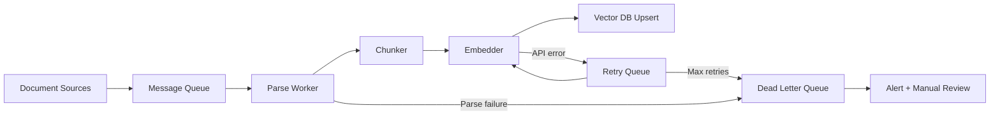

# Ingestion Pipelines

**Interview weight:** 🔥🔥🔥 | **Prerequisites:** [Designing Before Building](../module-02/01-requirements.md) | **Builds toward:** [Reliability & Monitoring](02-reliability.md), [Parsing Every Format](../module-04/01-parsing-formats.md)

## 🗣️ In Plain English

::: tip In Plain English
Think of a newspaper printing pipeline. Stories arrive continuously from reporters, get typeset by editors, and must hit the morning edition. Batch ingestion is the nightly print run — collect everything, process once, publish. Streaming ingestion is the live website — each story goes online the moment it's filed. Your choice depends on whether readers tolerate yesterday's news or need the latest headline.
:::

## ⚙️ Under the Hood

### The Four Ingestion Patterns

Every RAG ingestion pipeline falls into one of four patterns, determined by the freshness requirements from Module 2:

| Pattern | Trigger | Freshness | Complexity | Use Case |
|---------|---------|-----------|------------|----------|
| **Batch** | Cron schedule | Hours to days | Low | Stable corpora, overnight re-index |
| **Incremental** | Change detection | Hours | Low-Medium | Growing corpora, daily delta sync |
| **Event-driven** | Webhook / S3 event | Minutes | Medium | User uploads, CMS updates |
| **Streaming** | Message stream | Seconds | High | News feeds, real-time sources |

### Pattern 1: Batch Ingestion

The simplest pattern. A cron job runs periodically, processes all (or changed) documents, and updates the index.

```text
Batch Ingestion

  ┌──────────┐    Cron (daily)     ┌────────────┐
  │  Source   │ ──────────────────► │  Worker    │
  │  (S3,    │                     │  Process   │
  │   DB,    │                     │  (parse,   │
  │   API)   │                     │   chunk,   │
  │          │                     │   embed,   │
  └──────────┘                     │   upsert)  │
                                   └─────┬──────┘
                                         │
                                         ▼
                                   ┌───────────┐
                                   │ Vector DB │
                                   └───────────┘
```

```typescript
// run: npx tsx batch_ingestion.ts
// Conceptual batch ingestion pipeline

import { createHash } from "node:crypto";
import { readdir, readFile, stat } from "node:fs/promises";
import { join, resolve } from "node:path";

interface Document {
  id: string;
  content: string;
  source: string;
  contentHash: string;
  lastModified: Date;
}

interface Chunk {
  text: string;
}

function computeHash(content: string): string {
  /** Content hash for deduplication and change detection. */
  return createHash("sha256").update(content).digest("hex");
}

async function batchIngest(
  sourceDir: string,
  vectorDb: any,   // your vector DB client
  embedder: (texts: string[]) => Promise<number[][]>,
  chunker: (content: string, metadata: Record<string, string>) => Chunk[],
): Promise<{ processed: number; skipped: number; errors: number }> {
  /** Full batch ingestion with change detection. */
  const stats = { processed: 0, skipped: 0, errors: 0 };

  async function walkDir(dir: string): Promise<string[]> {
    const entries = await readdir(dir, { withFileTypes: true });
    const files: string[] = [];
    for (const entry of entries) {
      const fullPath = join(dir, entry.name);
      if (entry.isDirectory()) files.push(...await walkDir(fullPath));
      else files.push(fullPath);
    }
    return files;
  }

  const filePaths = await walkDir(resolve(sourceDir));

  for (const filePath of filePaths) {
    try {
      const content = await readFile(filePath, "utf-8");
      const contentHash = computeHash(content);

      // Skip if already indexed with same hash
      const existing = await vectorDb.getBySource(filePath);
      if (existing && existing.contentHash === contentHash) {
        stats.skipped += 1;
        continue;
      }

      // Parse → Chunk → Embed → Upsert
      const chunks = chunker(content, { source: filePath });
      const embeddings = await embedder(chunks.map((c) => c.text));

      await vectorDb.upsert({
        ids: chunks.map((_, i) => `${filePath}::${i}`),
        embeddings,
        documents: chunks.map((c) => c.text),
        metadatas: chunks.map((_, i) => ({
          source: filePath,
          chunk_index: i,
          content_hash: contentHash,
          ingested_at: new Date().toISOString(),
        })),
      });
      stats.processed += 1;

    } catch (e) {
      console.error(`Error processing ${filePath}: ${e}`);
      stats.errors += 1;
    }
  }

  return stats;
}
```

**When to use:** Corpus changes slowly (daily or less), full re-index is acceptable, simplicity is preferred over freshness.

### Pattern 2: Incremental Ingestion

Only processes documents that have changed since the last run. Uses content hashing or timestamps for change detection.

```text
Incremental Ingestion

  ┌──────────┐   List changes     ┌────────────┐
  │  Source   │ ─────────────────► │  Change    │
  │          │   since last run   │  Detector  │
  └──────────┘                    └─────┬──────┘
                                        │
                              ┌─────────┼─────────┐
                              │         │         │
                              ▼         ▼         ▼
                           New      Modified   Deleted
                           docs      docs       docs
                              │         │         │
                              ▼         ▼         ▼
                           Insert    Re-embed  Remove
                           chunks    + upsert  from index
```

```typescript
// run: npx tsx incremental_ingestion.ts

interface ChangeSet {
  added: string[];      // new document IDs
  modified: string[];   // changed document IDs
  deleted: string[];    // removed document IDs
}

interface Chunk {
  text: string;
}

function detectChanges(
  source: any,
  lastSyncTimestamp: Date,
): ChangeSet {
  /** Detect what changed since last sync. */
  // Option 1: Use source API's change feed
  // (Confluence, Google Drive, SharePoint all have delta APIs)
  const changes = source.getChangesSince(lastSyncTimestamp);

  // Option 2: Compare content hashes
  // const currentHashes = new Map(source.listAll().map(doc => [doc.id, hash(doc)]));
  // const indexedHashes = vectorDb.getAllHashes();
  // const added = [...currentHashes.keys()].filter(id => !indexedHashes.has(id));
  // const deleted = [...indexedHashes.keys()].filter(id => !currentHashes.has(id));
  // const modified = [...currentHashes.keys()].filter(id =>
  //   indexedHashes.has(id) && currentHashes.get(id) !== indexedHashes.get(id));

  return {
    added: changes.createdIds,
    modified: changes.updatedIds,
    deleted: changes.deletedIds,
  };
}

async function incrementalIngest(
  source: any,
  vectorDb: any,
  embedder: (texts: string[]) => Promise<number[][]>,
  chunker: (content: string) => Chunk[],
): Promise<{ added: number; modified: number; deleted: number }> {
  /** Process only changed documents. */
  const lastSync = await vectorDb.getMetadata("last_sync_timestamp");
  const changes = detectChanges(source, lastSync);

  // Process additions and modifications (same logic)
  for (const docId of [...changes.added, ...changes.modified]) {
    const doc = await source.getDocument(docId);
    // Delete old chunks for this doc (if modified)
    await vectorDb.delete({ filter: { source_doc_id: docId } });
    // Re-chunk, re-embed, insert
    const chunks = chunker(doc.content);
    const embeddings = await embedder(chunks.map((c) => c.text));
    await vectorDb.upsert({
      ids: chunks.map((_, i) => `${docId}::${i}`),
      embeddings,
      documents: chunks.map((c) => c.text),
      metadatas: chunks.map(() => ({ source_doc_id: docId })),
    });
  }

  // Process deletions
  for (const docId of changes.deleted) {
    await vectorDb.delete({ filter: { source_doc_id: docId } });
  }

  // Update sync timestamp
  await vectorDb.setMetadata(
    "last_sync_timestamp",
    new Date().toISOString(),
  );

  return {
    added: changes.added.length,
    modified: changes.modified.length,
    deleted: changes.deleted.length,
  };
}
```

### Pattern 3: Event-Driven Ingestion

Documents are processed as events occur — a file is uploaded to S3, a page is updated in Confluence, a webhook fires.

```text
Event-Driven Ingestion

  ┌──────────┐
  │  S3 Put  │──┐
  └──────────┘  │    ┌─────────┐    ┌──────────┐    ┌───────────┐
  ┌──────────┐  ├──► │  Queue  │──► │  Worker  │──► │ Vector DB │
  │ Webhook  │──┤    │ (SQS /  │    │ (parse,  │    └───────────┘
  └──────────┘  │    │  Kafka) │    │  chunk,  │
  ┌──────────┐  │    └─────────┘    │  embed,  │
  │ API Call │──┘                   │  upsert) │
  └──────────┘                     └──────────┘
```

This is the production baseline for most RAG systems. The queue decouples event producers from processing, provides backpressure, and enables retries.

```typescript
// run: npx tsx ingestion_api.ts
// Requires: npm install bullmq ioredis express multer

import { createHash } from "node:crypto";
import { Queue, Worker, Job } from "bullmq";
import express from "express";
import multer from "multer";

const app = express();
const upload = multer({ storage: multer.memoryStorage() });

// BullMQ for async task processing
const ingestionQueue = new Queue("ingestion", {
  connection: { host: "localhost", port: 6379 },
});

// Worker: processes documents from the queue
const worker = new Worker(
  "ingestion",
  async (job: Job<{ docId: string; s3Path: string; contentHash: string }>) => {
    const { docId, s3Path, contentHash } = job.data;

    // 1. Download from S3
    const content = await downloadFromS3(s3Path);

    // 2. Verify hash (idempotency check)
    const actualHash = createHash("sha256").update(content).digest("hex");
    if (actualHash !== contentHash) {
      throw new Error("Content hash mismatch — file changed during processing");
    }

    // 3. Check if already processed (dedup)
    const existing = await vectorDb.getByHash(contentHash);
    if (existing) {
      return { status: "skipped", reason: "already_indexed" };
    }

    // 4. Parse based on file type
    const parsed = parseDocument(content, s3Path);

    // 5. Chunk
    const chunks = chunkDocument(parsed);

    // 6. Embed
    const embeddings = await embedChunks(chunks.map((c) => c.text));

    // 7. Upsert to vector DB
    await vectorDb.upsert({
      ids: chunks.map((_, i) => `${docId}::${i}`),
      embeddings,
      documents: chunks.map((c) => c.text),
      metadatas: chunks.map((_, i) => ({
        doc_id: docId,
        s3_path: s3Path,
        content_hash: contentHash,
        chunk_index: i,
      })),
    });

    return { status: "success", chunks: chunks.length };
  },
  {
    connection: { host: "localhost", port: 6379 },
    concurrency: 5,
  },
);

// Configure retries with exponential backoff
worker.on("failed", (job, err) => {
  console.error(`Job ${job?.id} failed: ${err.message}`);
});

app.post("/ingest", upload.single("file"), async (req, res) => {
  /** API endpoint that queues document for async processing. */
  const file = req.file!;
  const contentHash = createHash("sha256").update(file.buffer).digest("hex");
  const docId = `doc-${contentHash.slice(0, 12)}`;

  // Upload to S3 (durable storage before processing)
  const s3Path = `ingestion/${docId}/${file.originalname}`;
  await uploadToS3(file.buffer, s3Path);

  // Queue the processing task
  const job = await ingestionQueue.add("process_document", {
    docId,
    s3Path,
    contentHash,
  }, {
    attempts: 4,
    backoff: { type: "exponential", delay: 60_000 },
  });

  res.json({ doc_id: docId, task_id: job.id, status: "queued" });
});

app.get("/ingest/:taskId/status", async (req, res) => {
  /** Check processing status. */
  const job = await ingestionQueue.getJob(req.params.taskId);
  if (!job) return res.status(404).json({ error: "Job not found" });

  const state = await job.getState();
  res.json({
    task_id: job.id,
    status: state,
    result: state === "completed" ? job.returnvalue : null,
  });
});

app.listen(3000, () => console.log("Ingestion API on :3000"));
```

### Pattern 4: Streaming Ingestion

For systems that need seconds-level freshness. Uses a message stream (Kafka, Kinesis) as the backbone.

```text
Streaming Ingestion

  ┌──────────┐    ┌─────────────┐    ┌──────────────┐    ┌───────────┐
  │ Producer │──► │   Kafka     │──► │  Consumer    │──► │ Vector DB │
  │ (CDC,    │    │  Topic:     │    │  Group:      │    └───────────┘
  │  webhook,│    │  documents  │    │  embedder    │
  │  crawler)│    │             │    │  (N workers) │
  └──────────┘    └─────────────┘    └──────────────┘

  Features:
  - Ordered processing (per partition)
  - Consumer group scaling (add workers)
  - Replay from offset (re-process on failure)
  - Backpressure via consumer lag monitoring
```

### Queue Comparison

Choosing the right queue is one of the most impactful infrastructure decisions:

| Queue | Ordering | Delivery | Throughput | Latency | Persistence | Best For |
|-------|----------|----------|------------|---------|-------------|----------|
| **Kafka** | Per-partition | At-least-once (default) | Very high (100K+/s) | Low (ms) | Durable (configurable retention) | High-volume streaming, event sourcing, replay |
| **RabbitMQ** | Per-queue (FIFO) | At-least-once or at-most-once | High (10K+/s) | Low (ms) | Durable (with persistence enabled) | Complex routing, priority queues, RPC patterns |
| **SQS** | Best-effort (Standard) / FIFO | At-least-once | High | Higher (100ms+) | Durable (14-day retention) | AWS-native, simple queue, no infra to manage |
| **Redis Streams** | Per-stream | At-least-once (with consumer groups) | Very high | Very low (sub-ms) | Durable (with AOF) | Low-latency, Redis already in stack |
| **BullMQ** | Per-queue (FIFO) | At-least-once | Medium (1K+/s) | Low | Redis-backed | Node.js ecosystem, job scheduling, delayed jobs |
| **Celery** | Per-queue | At-least-once (with acks_late) | Medium | Medium | Broker-dependent (Redis/RabbitMQ) | Python ecosystem, distributed task execution |

**Decision guide:**

```text
Already using AWS and want managed?          → SQS
Need replay and high throughput?             → Kafka
Python stack, need task queue with retries?  → Celery + Redis/RabbitMQ
Node.js stack, need job scheduling?          → BullMQ
Already have Redis, need lightweight queue?  → Redis Streams
Need complex routing (dead-letter, priority)?→ RabbitMQ
```

### The Production Pipeline: Full Architecture

```text
┌────────────────────────────────────────────────────────────────┐
│                    PRODUCTION INGESTION PIPELINE               │
│                                                                │
│  Sources              Storage        Queue        Workers      │
│  ┌────────┐                                                    │
│  │  S3    │──┐                                                 │
│  └────────┘  │       ┌────────┐    ┌────────┐    ┌──────────┐  │
│  ┌────────┐  ├──────►│ Object │──► │ Message│──► │ Worker 1 │  │
│  │Webhooks│──┤       │ Store  │    │ Queue  │    ├──────────┤  │
│  └────────┘  │       │ (S3)   │    │(SQS/   │    │ Worker 2 │  │
│  ┌────────┐  │       └────────┘    │ Kafka) │    ├──────────┤  │
│  │  API   │──┘                     └────────┘    │ Worker N │  │
│  └────────┘                                      └────┬─────┘  │
│                                                       │        │
│                                    ┌──────────────────┘        │
│                                    │                           │
│                                    ▼                           │
│                         ┌────────────────────┐                 │
│                         │   Worker Pipeline  │                 │
│                         │                    │                 │
│                         │  Parse (extract    │                 │
│                         │    text from PDF,  │    ┌─────────┐  │
│                         │    HTML, etc.)     │    │  DLQ    │  │
│                         │       │           │    │ (failed │  │
│                         │       ▼           │    │  docs)  │  │
│                         │  Chunk (split     │◄───│         │  │
│                         │    into pieces)   │    └─────────┘  │
│                         │       │           │                 │
│                         │       ▼           │                 │
│                         │  Embed (text →    │                 │
│                         │    vectors via    │                 │
│                         │    API/local)     │                 │
│                         │       │           │                 │
│                         │       ▼           │                 │
│                         │  Upsert (store    │                 │
│                         │    in vector DB)  │                 │
│                         └────────────────────┘                 │
│                                    │                           │
│                                    ▼                           │
│                              ┌───────────┐                     │
│                              │ Vector DB │                     │
│                              └───────────┘                     │
│                                                                │
│  Monitoring: ingestion lag, error rate, queue depth,           │
│  embedding throughput, processing latency per doc              │
└────────────────────────────────────────────────────────────────┘
```



### Why Ingestion Must Be Async

Synchronous ingestion (user uploads → wait → response) breaks in production:

| Problem | Synchronous | Async (Queue-Based) |
|---------|------------|-------------------|
| **Timeout** | Large PDF takes 30s to process; HTTP times out | Queue holds the job; worker takes as long as needed |
| **Failure** | Embedding API 503 → user sees error, doc not indexed | Worker retries with backoff; user notified when done |
| **Scaling** | Spike of 100 uploads → 100 concurrent embedding API calls → rate limited | Queue buffers; workers process at sustainable rate |
| **Cost** | API server holds connection open, wasting compute | API server responds immediately, workers scale independently |
| **Observability** | Failure logged as HTTP error somewhere | Job status trackable, DLQ inspectable, metrics per stage |

```typescript
// WRONG: Synchronous ingestion in the API handler
app.post("/upload", upload.single("file"), async (req, res) => {
  const content = req.file!.buffer;
  const chunks = chunk(parse(content));         // Could take 30s for large PDF
  const embeddings = await embed(chunks);       // Could fail (rate limit)
  await vectorDb.upsert(embeddings);            // Could be slow
  res.json({ status: "indexed" });              // User waited for all of this
});


// RIGHT: Async ingestion with queue
app.post("/upload", upload.single("file"), async (req, res) => {
  const content = req.file!.buffer;
  const s3Path = await uploadToS3(content);     // Durable storage first
  const job = await queue.add(                  // Queue for async processing
    "process_document",
    { s3Path },
  );
  res.json({                                    // Respond immediately
    task_id: job.id,
    status: "queued",
    status_url: `/tasks/${job.id}`,
  });
});
```

### Scaling Ingestion Workers

| Strategy | When to Use | How |
|----------|------------|-----|
| **Vertical** | Single worker is too slow | Increase CPU/RAM; batch embedding calls |
| **Horizontal** | Queue depth growing | Add more workers (consumer group) |
| **Batched embedding** | Embedding API is the bottleneck | Batch 100+ chunks per API call |
| **Parallel parsing** | Parsing (especially OCR) is slow | Process multiple documents concurrently |
| **Rate limiting** | Embedding API has rate limits | Token bucket on the worker side |

```typescript
// run: npx tsx embed_in_batches.ts
// Batched embedding for throughput
// Instead of embedding one chunk at a time:

async function embedInBatches(
  chunks: string[],
  batchSize = 100,
  maxConcurrent = 5,
): Promise<number[][]> {
  /** Embed chunks in batches with concurrency control. */
  const allEmbeddings: number[][] = [];

  // Split into batches
  const batches: string[][] = [];
  for (let i = 0; i < chunks.length; i += batchSize) {
    batches.push(chunks.slice(i, i + batchSize));
  }

  // Process with concurrency limit
  let running = 0;
  let index = 0;

  async function processBatch(batch: string[]): Promise<number[][]> {
    return embeddingApi.embed(batch);
  }

  // Simple semaphore-based concurrency control
  const results: number[][][] = [];
  for (let i = 0; i < batches.length; i += maxConcurrent) {
    const slice = batches.slice(i, i + maxConcurrent);
    const batchResults = await Promise.all(slice.map(processBatch));
    results.push(...batchResults);
  }

  for (const batchResult of results) {
    allEmbeddings.push(...batchResult);
  }

  return allEmbeddings;
}
```

## 💥 Where It Bites (Production Lens)

::: warning Where It Bites

**1. No durable storage before queuing.**
Documents go directly from the upload API to the queue. The queue loses the message (happens with at-most-once delivery), and the document is gone forever — it was never saved to S3. Symptom: randomly missing documents in the index. Fix: always persist to object storage (S3) before queueing. The queue message should reference the S3 path, not contain the document.

**2. Embedding API rate limits during bulk ingestion.**
You start a full re-index of 1M documents. The embedding API (OpenAI) has a rate limit of 1M tokens/minute. Your workers blast through the queue and hit 429 errors. Without proper backoff, they retry immediately, making it worse. Symptom: ingestion stalls, retries pile up, DLQ fills. Fix: implement token-bucket rate limiting on the worker side, use batched embedding calls, and add exponential backoff with jitter on 429s.

**3. Queue depth grows faster than workers can process.**
A burst of 10,000 documents hit the queue (e.g., initial bulk load), but you only have 2 workers. Embedding each document takes 5 seconds. Processing time: 10,000 x 5s / 2 workers = ~7 hours. Meanwhile, users expect documents to be searchable in minutes. Symptom: growing queue lag, stale search results. Fix: auto-scale workers based on queue depth, or separate bulk ingestion (batch, run overnight) from real-time ingestion (event-driven, processed immediately).

**4. Silent parsing failures.**
A malformed PDF fails to parse. The worker catches the exception, logs it, and moves on. Nobody monitors the logs. 500 PDFs silently fail over 3 months. Symptom: users report "the system doesn't know about" specific documents. Fix: structured error logging, DLQ for failed documents, alerting on error rate, and a dashboard showing documents in each state (queued, processing, indexed, failed).

:::

## 🎯 Checkpoint

::: details Question 1 — Pattern selection
**Q:** You are building a RAG system for a news organization. They publish 200 articles/day and need them searchable within 5 minutes. They also have a 10-year archive of 500K articles. What ingestion pattern(s) do you use, and how do you handle the initial archive?

**A:** Two patterns: (1) **Event-driven** for new articles — set up a webhook from the CMS that fires on publish. The webhook pushes to an SQS queue, workers parse/chunk/embed/index. With 200 articles/day, a single worker can handle this easily (200 x 5s = ~17 minutes of processing spread over 24 hours). This meets the 5-minute freshness requirement. (2) **Batch** for the 10-year archive — run as a one-time bulk ingestion job, separate from the real-time pipeline. Process in batches of 1,000 with multiple workers to parallelize. At 5s per article, 500K articles takes 500K x 5s / N workers. With 10 workers: ~70 hours. Run over a weekend. Use a separate queue or priority level so bulk ingestion does not block real-time processing. After the archive is loaded, the batch pipeline becomes a safety net — run weekly as a reconciliation to catch any events the webhook missed.
:::

::: details Question 2 — Queue selection
**Q:** Compare Kafka and SQS for a RAG ingestion pipeline processing 10K documents/day with 30-second freshness targets. What are the key trade-offs?

**A:** **Kafka:** Pros — durable log (can replay from any offset if you need to re-process), ordering guarantees (per partition), built-in consumer groups for scaling, high throughput. Cons — operational overhead (cluster management, ZooKeeper/KRaft, monitoring), overkill for 10K docs/day (Kafka shines at 100K+/s). **SQS:** Pros — fully managed (zero ops), pay-per-use, built-in DLQ, automatic scaling, integrates natively with Lambda/ECS. Cons — no replay (once consumed and deleted, gone), best-effort ordering (Standard) or limited throughput (FIFO: 300 msg/s), higher per-message latency (~100ms). **For this scenario:** SQS wins. 10K docs/day is ~0.1 msgs/second — well within SQS limits. The operational simplicity of a managed service outweighs Kafka's advantages at this scale. The 30-second freshness target is achievable with SQS (worker polls every few seconds). If you need replay capability, keep the raw documents in S3 and re-queue from S3 if re-processing is needed — this is cheaper than running a Kafka cluster.
:::

::: details Question 3 — Async vs sync
**Q:** A junior engineer argues that async ingestion adds unnecessary complexity for their small-scale prototype (100 documents, 10 queries/day). Are they right? When does async become non-negotiable?

**A:** They are right for the prototype. At 100 documents, you can embed them all in a startup script that runs in 30 seconds. There is no need for a queue, workers, or task tracking. Synchronous ingestion is fine. Async becomes non-negotiable when: (1) **Ingestion time exceeds HTTP timeout** — a large PDF takes 30+ seconds to parse + embed, causing gateway timeouts. (2) **Concurrent uploads** — multiple users uploading simultaneously overwhelm the embedding API rate limit. (3) **Failure recovery** — you need retries, DLQ, and status tracking for failed documents. (4) **Scale** — processing time grows linearly with document count; you need to parallelize across workers. Rule of thumb: if any single document takes more than 5 seconds to process, or you have more than 10 concurrent uploads, add a queue. The transition point is usually around 1,000 documents or 100 uploads/day.
:::

## Key Mental Models

- **Store before you queue.** Persist the document to durable storage (S3) before putting a message on the queue. The queue message is a reference, not the payload. Lost messages are retriable; lost documents are not.
- **Decouple ingestion from the API.** The upload endpoint returns immediately after queuing. Processing happens asynchronously. This gives you independent scaling, retry semantics, and no timeouts.
- **Match the pattern to the freshness SLA.** Days → batch cron. Hours → incremental. Minutes → event-driven with queue. Seconds → streaming (Kafka). Over-engineering freshness is as wasteful as under-engineering it.
- **Queue depth is your canary.** If queue depth is growing, your workers cannot keep up. Alert on queue depth, not just error rates.
- **Bulk and real-time are separate pipelines.** Initial data loads and ongoing updates have different throughput, priority, and failure-handling needs. Do not mix them in one queue.

## Related

- [Reliability & Monitoring](02-reliability.md) — idempotency, retries, DLQs, and monitoring for everything built here
- [Designing Before Building](../module-02/01-requirements.md) — the freshness and scale requirements that drive pattern selection
- [Parsing Every Format](../module-04/01-parsing-formats.md) — the parsing step inside the worker pipeline
