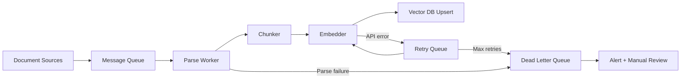

# Ingestion Pipelines

**Interview weight:** 🔥🔥🔥 | **Prerequisites:** [Designing Before Building](../module-02/01-requirements.md) | **Builds toward:** [Reliability & Monitoring](02-reliability.md), [Parsing Every Format](../module-04/01-parsing-formats.md)

## 🗣️ In Plain English

::: tip In Plain English
Think of a newspaper printing pipeline. Stories arrive continuously from reporters, get typeset by editors, and must hit the morning edition. Batch ingestion is the nightly print run — collect everything, process once, publish. Streaming ingestion is the live website — each story goes online the moment it's filed. Your choice depends on whether readers tolerate yesterday's news or need the latest headline.
:::

## ⚙️ Under the Hood

### The Four Ingestion Patterns

Every RAG ingestion pipeline falls into one of four patterns, determined by the freshness requirements from Module 2:

| Pattern | Trigger | Freshness | Complexity | Use Case |
|---------|---------|-----------|------------|----------|
| **Batch** | Cron schedule | Hours to days | Low | Stable corpora, overnight re-index |
| **Incremental** | Change detection | Hours | Low-Medium | Growing corpora, daily delta sync |
| **Event-driven** | Webhook / S3 event | Minutes | Medium | User uploads, CMS updates |
| **Streaming** | Message stream | Seconds | High | News feeds, real-time sources |

### Pattern 1: Batch Ingestion

The simplest pattern. A cron job runs periodically, processes all (or changed) documents, and updates the index.

```text
Batch Ingestion

  ┌──────────┐    Cron (daily)     ┌────────────┐
  │  Source   │ ──────────────────► │  Worker    │
  │  (S3,    │                     │  Process   │
  │   DB,    │                     │  (parse,   │
  │   API)   │                     │   chunk,   │
  │          │                     │   embed,   │
  └──────────┘                     │   upsert)  │
                                   └─────┬──────┘
                                         │
                                         ▼
                                   ┌───────────┐
                                   │ Vector DB │
                                   └───────────┘
```

```python
# run: python batch_ingestion.py
# Conceptual batch ingestion pipeline

import hashlib
from datetime import datetime, timezone
from pathlib import Path
from dataclasses import dataclass


@dataclass
class Document:
    id: str
    content: str
    source: str
    content_hash: str
    last_modified: datetime


def compute_hash(content: str) -> str:
    """Content hash for deduplication and change detection."""
    return hashlib.sha256(content.encode()).hexdigest()


def batch_ingest(
    source_dir: Path,
    vector_db,  # your vector DB client
    embedder,   # your embedding function
    chunker,    # your chunking function
) -> dict[str, int]:
    """Full batch ingestion with change detection."""
    stats = {"processed": 0, "skipped": 0, "errors": 0}

    for file_path in source_dir.rglob("*"):
        if not file_path.is_file():
            continue

        try:
            content = file_path.read_text()
            content_hash = compute_hash(content)

            # Skip if already indexed with same hash
            existing = vector_db.get_by_source(str(file_path))
            if existing and existing.content_hash == content_hash:
                stats["skipped"] += 1
                continue

            # Parse → Chunk → Embed → Upsert
            chunks = chunker(content, metadata={"source": str(file_path)})
            embeddings = embedder([c.text for c in chunks])

            vector_db.upsert(
                ids=[f"{file_path}::{i}" for i in range(len(chunks))],
                embeddings=embeddings,
                documents=[c.text for c in chunks],
                metadatas=[
                    {
                        "source": str(file_path),
                        "chunk_index": i,
                        "content_hash": content_hash,
                        "ingested_at": datetime.now(timezone.utc).isoformat(),
                    }
                    for i in range(len(chunks))
                ],
            )
            stats["processed"] += 1

        except Exception as e:
            print(f"Error processing {file_path}: {e}")
            stats["errors"] += 1

    return stats
```

**When to use:** Corpus changes slowly (daily or less), full re-index is acceptable, simplicity is preferred over freshness.

### Pattern 2: Incremental Ingestion

Only processes documents that have changed since the last run. Uses content hashing or timestamps for change detection.

```text
Incremental Ingestion

  ┌──────────┐   List changes     ┌────────────┐
  │  Source   │ ─────────────────► │  Change    │
  │          │   since last run   │  Detector  │
  └──────────┘                    └─────┬──────┘
                                        │
                              ┌─────────┼─────────┐
                              │         │         │
                              ▼         ▼         ▼
                           New      Modified   Deleted
                           docs      docs       docs
                              │         │         │
                              ▼         ▼         ▼
                           Insert    Re-embed  Remove
                           chunks    + upsert  from index
```

```python
# run: python incremental_ingestion.py

from datetime import datetime, timezone
from dataclasses import dataclass


@dataclass
class ChangeSet:
    added: list[str]      # new document IDs
    modified: list[str]   # changed document IDs
    deleted: list[str]    # removed document IDs


def detect_changes(
    source,
    last_sync_timestamp: datetime,
) -> ChangeSet:
    """Detect what changed since last sync."""
    # Option 1: Use source API's change feed
    # (Confluence, Google Drive, SharePoint all have delta APIs)
    changes = source.get_changes_since(last_sync_timestamp)

    # Option 2: Compare content hashes
    # current_hashes = {doc.id: hash(doc) for doc in source.list_all()}
    # indexed_hashes = vector_db.get_all_hashes()
    # added = set(current_hashes) - set(indexed_hashes)
    # deleted = set(indexed_hashes) - set(current_hashes)
    # modified = {id for id in current_hashes & indexed_hashes
    #             if current_hashes[id] != indexed_hashes[id]}

    return ChangeSet(
        added=changes.created_ids,
        modified=changes.updated_ids,
        deleted=changes.deleted_ids,
    )


def incremental_ingest(source, vector_db, embedder, chunker):
    """Process only changed documents."""
    last_sync = vector_db.get_metadata("last_sync_timestamp")
    changes = detect_changes(source, last_sync)

    # Process additions and modifications (same logic)
    for doc_id in changes.added + changes.modified:
        doc = source.get_document(doc_id)
        # Delete old chunks for this doc (if modified)
        vector_db.delete(filter={"source_doc_id": doc_id})
        # Re-chunk, re-embed, insert
        chunks = chunker(doc.content)
        embeddings = embedder([c.text for c in chunks])
        vector_db.upsert(
            ids=[f"{doc_id}::{i}" for i in range(len(chunks))],
            embeddings=embeddings,
            documents=[c.text for c in chunks],
            metadatas=[{"source_doc_id": doc_id} for _ in chunks],
        )

    # Process deletions
    for doc_id in changes.deleted:
        vector_db.delete(filter={"source_doc_id": doc_id})

    # Update sync timestamp
    vector_db.set_metadata(
        "last_sync_timestamp",
        datetime.now(timezone.utc).isoformat(),
    )

    return {
        "added": len(changes.added),
        "modified": len(changes.modified),
        "deleted": len(changes.deleted),
    }
```

### Pattern 3: Event-Driven Ingestion

Documents are processed as events occur — a file is uploaded to S3, a page is updated in Confluence, a webhook fires.

```text
Event-Driven Ingestion

  ┌──────────┐
  │  S3 Put  │──┐
  └──────────┘  │    ┌─────────┐    ┌──────────┐    ┌───────────┐
  ┌──────────┐  ├──► │  Queue  │──► │  Worker  │──► │ Vector DB │
  │ Webhook  │──┤    │ (SQS /  │    │ (parse,  │    └───────────┘
  └──────────┘  │    │  Kafka) │    │  chunk,  │
  ┌──────────┐  │    └─────────┘    │  embed,  │
  │ API Call │──┘                   │  upsert) │
  └──────────┘                     └──────────┘
```

This is the production baseline for most RAG systems. The queue decouples event producers from processing, provides backpressure, and enables retries.

```python
# run: uvicorn ingestion_api:app --reload
# Requires: pip install fastapi celery redis

from fastapi import FastAPI, UploadFile, BackgroundTasks
from celery import Celery
import hashlib

app = FastAPI()

# Celery for async task processing
celery_app = Celery(
    "ingestion",
    broker="redis://localhost:6379/0",
    backend="redis://localhost:6379/1",
)


@celery_app.task(
    bind=True,
    max_retries=3,
    default_retry_delay=60,  # 60s between retries
    acks_late=True,          # acknowledge after processing (at-least-once)
)
def process_document(self, doc_id: str, s3_path: str, content_hash: str):
    """Async document processing task."""
    try:
        # 1. Download from S3
        content = download_from_s3(s3_path)

        # 2. Verify hash (idempotency check)
        actual_hash = hashlib.sha256(content.encode()).hexdigest()
        if actual_hash != content_hash:
            raise ValueError("Content hash mismatch — file changed during processing")

        # 3. Check if already processed (dedup)
        existing = vector_db.get_by_hash(content_hash)
        if existing:
            return {"status": "skipped", "reason": "already_indexed"}

        # 4. Parse based on file type
        parsed = parse_document(content, s3_path)

        # 5. Chunk
        chunks = chunk_document(parsed)

        # 6. Embed
        embeddings = embed_chunks([c.text for c in chunks])

        # 7. Upsert to vector DB
        vector_db.upsert(
            ids=[f"{doc_id}::{i}" for i in range(len(chunks))],
            embeddings=embeddings,
            documents=[c.text for c in chunks],
            metadatas=[{
                "doc_id": doc_id,
                "s3_path": s3_path,
                "content_hash": content_hash,
                "chunk_index": i,
            } for i in range(len(chunks))],
        )

        return {"status": "success", "chunks": len(chunks)}

    except Exception as exc:
        # Retry with exponential backoff
        raise self.retry(exc=exc, countdown=60 * (2 ** self.request.retries))


@app.post("/ingest")
async def ingest_document(file: UploadFile):
    """API endpoint that queues document for async processing."""
    content = await file.read()
    content_hash = hashlib.sha256(content).hexdigest()
    doc_id = f"doc-{content_hash[:12]}"

    # Upload to S3 (durable storage before processing)
    s3_path = f"ingestion/{doc_id}/{file.filename}"
    upload_to_s3(content, s3_path)

    # Queue the processing task
    task = process_document.delay(doc_id, s3_path, content_hash)

    return {
        "doc_id": doc_id,
        "task_id": task.id,
        "status": "queued",
    }


@app.get("/ingest/{task_id}/status")
async def get_ingestion_status(task_id: str):
    """Check processing status."""
    result = celery_app.AsyncResult(task_id)
    return {
        "task_id": task_id,
        "status": result.status,
        "result": result.result if result.ready() else None,
    }
```

### Pattern 4: Streaming Ingestion

For systems that need seconds-level freshness. Uses a message stream (Kafka, Kinesis) as the backbone.

```text
Streaming Ingestion

  ┌──────────┐    ┌─────────────┐    ┌──────────────┐    ┌───────────┐
  │ Producer │──► │   Kafka     │──► │  Consumer    │──► │ Vector DB │
  │ (CDC,    │    │  Topic:     │    │  Group:      │    └───────────┘
  │  webhook,│    │  documents  │    │  embedder    │
  │  crawler)│    │             │    │  (N workers) │
  └──────────┘    └─────────────┘    └──────────────┘

  Features:
  - Ordered processing (per partition)
  - Consumer group scaling (add workers)
  - Replay from offset (re-process on failure)
  - Backpressure via consumer lag monitoring
```

### Queue Comparison

Choosing the right queue is one of the most impactful infrastructure decisions:

| Queue | Ordering | Delivery | Throughput | Latency | Persistence | Best For |
|-------|----------|----------|------------|---------|-------------|----------|
| **Kafka** | Per-partition | At-least-once (default) | Very high (100K+/s) | Low (ms) | Durable (configurable retention) | High-volume streaming, event sourcing, replay |
| **RabbitMQ** | Per-queue (FIFO) | At-least-once or at-most-once | High (10K+/s) | Low (ms) | Durable (with persistence enabled) | Complex routing, priority queues, RPC patterns |
| **SQS** | Best-effort (Standard) / FIFO | At-least-once | High | Higher (100ms+) | Durable (14-day retention) | AWS-native, simple queue, no infra to manage |
| **Redis Streams** | Per-stream | At-least-once (with consumer groups) | Very high | Very low (sub-ms) | Durable (with AOF) | Low-latency, Redis already in stack |
| **BullMQ** | Per-queue (FIFO) | At-least-once | Medium (1K+/s) | Low | Redis-backed | Node.js ecosystem, job scheduling, delayed jobs |
| **Celery** | Per-queue | At-least-once (with acks_late) | Medium | Medium | Broker-dependent (Redis/RabbitMQ) | Python ecosystem, distributed task execution |

**Decision guide:**

```text
Already using AWS and want managed?          → SQS
Need replay and high throughput?             → Kafka
Python stack, need task queue with retries?  → Celery + Redis/RabbitMQ
Node.js stack, need job scheduling?          → BullMQ
Already have Redis, need lightweight queue?  → Redis Streams
Need complex routing (dead-letter, priority)?→ RabbitMQ
```

### The Production Pipeline: Full Architecture

```text
┌────────────────────────────────────────────────────────────────┐
│                    PRODUCTION INGESTION PIPELINE               │
│                                                                │
│  Sources              Storage        Queue        Workers      │
│  ┌────────┐                                                    │
│  │  S3    │──┐                                                 │
│  └────────┘  │       ┌────────┐    ┌────────┐    ┌──────────┐  │
│  ┌────────┐  ├──────►│ Object │──► │ Message│──► │ Worker 1 │  │
│  │Webhooks│──┤       │ Store  │    │ Queue  │    ├──────────┤  │
│  └────────┘  │       │ (S3)   │    │(SQS/   │    │ Worker 2 │  │
│  ┌────────┐  │       └────────┘    │ Kafka) │    ├──────────┤  │
│  │  API   │──┘                     └────────┘    │ Worker N │  │
│  └────────┘                                      └────┬─────┘  │
│                                                       │        │
│                                    ┌──────────────────┘        │
│                                    │                           │
│                                    ▼                           │
│                         ┌────────────────────┐                 │
│                         │   Worker Pipeline  │                 │
│                         │                    │                 │
│                         │  Parse (extract    │                 │
│                         │    text from PDF,  │    ┌─────────┐  │
│                         │    HTML, etc.)     │    │  DLQ    │  │
│                         │       │           │    │ (failed │  │
│                         │       ▼           │    │  docs)  │  │
│                         │  Chunk (split     │◄───│         │  │
│                         │    into pieces)   │    └─────────┘  │
│                         │       │           │                 │
│                         │       ▼           │                 │
│                         │  Embed (text →    │                 │
│                         │    vectors via    │                 │
│                         │    API/local)     │                 │
│                         │       │           │                 │
│                         │       ▼           │                 │
│                         │  Upsert (store    │                 │
│                         │    in vector DB)  │                 │
│                         └────────────────────┘                 │
│                                    │                           │
│                                    ▼                           │
│                              ┌───────────┐                     │
│                              │ Vector DB │                     │
│                              └───────────┘                     │
│                                                                │
│  Monitoring: ingestion lag, error rate, queue depth,           │
│  embedding throughput, processing latency per doc              │
└────────────────────────────────────────────────────────────────┘
```



### Why Ingestion Must Be Async

Synchronous ingestion (user uploads → wait → response) breaks in production:

| Problem | Synchronous | Async (Queue-Based) |
|---------|------------|-------------------|
| **Timeout** | Large PDF takes 30s to process; HTTP times out | Queue holds the job; worker takes as long as needed |
| **Failure** | Embedding API 503 → user sees error, doc not indexed | Worker retries with backoff; user notified when done |
| **Scaling** | Spike of 100 uploads → 100 concurrent embedding API calls → rate limited | Queue buffers; workers process at sustainable rate |
| **Cost** | API server holds connection open, wasting compute | API server responds immediately, workers scale independently |
| **Observability** | Failure logged as HTTP error somewhere | Job status trackable, DLQ inspectable, metrics per stage |

```python
# WRONG: Synchronous ingestion in the API handler
@app.post("/upload")
async def upload_sync(file: UploadFile):
    content = await file.read()
    chunks = chunk(parse(content))         # Could take 30s for large PDF
    embeddings = embed(chunks)              # Could fail (rate limit)
    vector_db.upsert(embeddings)            # Could be slow
    return {"status": "indexed"}            # User waited for all of this


# RIGHT: Async ingestion with queue
@app.post("/upload")
async def upload_async(file: UploadFile):
    content = await file.read()
    s3_path = upload_to_s3(content)         # Durable storage first
    task_id = queue.enqueue(                # Queue for async processing
        "process_document",
        s3_path=s3_path,
    )
    return {                                # Respond immediately
        "task_id": task_id,
        "status": "queued",
        "status_url": f"/tasks/{task_id}",
    }
```

### Scaling Ingestion Workers

| Strategy | When to Use | How |
|----------|------------|-----|
| **Vertical** | Single worker is too slow | Increase CPU/RAM; batch embedding calls |
| **Horizontal** | Queue depth growing | Add more workers (consumer group) |
| **Batched embedding** | Embedding API is the bottleneck | Batch 100+ chunks per API call |
| **Parallel parsing** | Parsing (especially OCR) is slow | Process multiple documents concurrently |
| **Rate limiting** | Embedding API has rate limits | Token bucket on the worker side |

```python
# Batched embedding for throughput
# Instead of embedding one chunk at a time:

import asyncio
from itertools import batched  # Python 3.12+


async def embed_in_batches(
    chunks: list[str],
    batch_size: int = 100,
    max_concurrent: int = 5,
) -> list[list[float]]:
    """Embed chunks in batches with concurrency control."""
    semaphore = asyncio.Semaphore(max_concurrent)
    all_embeddings: list[list[float]] = []

    async def embed_batch(batch: tuple[str, ...]) -> list[list[float]]:
        async with semaphore:
            return await embedding_api.embed(list(batch))

    tasks = [
        embed_batch(batch)
        for batch in batched(chunks, batch_size)
    ]

    results = await asyncio.gather(*tasks)
    for batch_result in results:
        all_embeddings.extend(batch_result)

    return all_embeddings
```

## 💥 Where It Bites (Production Lens)

::: warning Where It Bites

**1. No durable storage before queuing.**
Documents go directly from the upload API to the queue. The queue loses the message (happens with at-most-once delivery), and the document is gone forever — it was never saved to S3. Symptom: randomly missing documents in the index. Fix: always persist to object storage (S3) before queueing. The queue message should reference the S3 path, not contain the document.

**2. Embedding API rate limits during bulk ingestion.**
You start a full re-index of 1M documents. The embedding API (OpenAI) has a rate limit of 1M tokens/minute. Your workers blast through the queue and hit 429 errors. Without proper backoff, they retry immediately, making it worse. Symptom: ingestion stalls, retries pile up, DLQ fills. Fix: implement token-bucket rate limiting on the worker side, use batched embedding calls, and add exponential backoff with jitter on 429s.

**3. Queue depth grows faster than workers can process.**
A burst of 10,000 documents hit the queue (e.g., initial bulk load), but you only have 2 workers. Embedding each document takes 5 seconds. Processing time: 10,000 x 5s / 2 workers = ~7 hours. Meanwhile, users expect documents to be searchable in minutes. Symptom: growing queue lag, stale search results. Fix: auto-scale workers based on queue depth, or separate bulk ingestion (batch, run overnight) from real-time ingestion (event-driven, processed immediately).

**4. Silent parsing failures.**
A malformed PDF fails to parse. The worker catches the exception, logs it, and moves on. Nobody monitors the logs. 500 PDFs silently fail over 3 months. Symptom: users report "the system doesn't know about" specific documents. Fix: structured error logging, DLQ for failed documents, alerting on error rate, and a dashboard showing documents in each state (queued, processing, indexed, failed).

:::

## 🎯 Checkpoint

::: details Question 1 — Pattern selection
**Q:** You are building a RAG system for a news organization. They publish 200 articles/day and need them searchable within 5 minutes. They also have a 10-year archive of 500K articles. What ingestion pattern(s) do you use, and how do you handle the initial archive?

**A:** Two patterns: (1) **Event-driven** for new articles — set up a webhook from the CMS that fires on publish. The webhook pushes to an SQS queue, workers parse/chunk/embed/index. With 200 articles/day, a single worker can handle this easily (200 x 5s = ~17 minutes of processing spread over 24 hours). This meets the 5-minute freshness requirement. (2) **Batch** for the 10-year archive — run as a one-time bulk ingestion job, separate from the real-time pipeline. Process in batches of 1,000 with multiple workers to parallelize. At 5s per article, 500K articles takes 500K x 5s / N workers. With 10 workers: ~70 hours. Run over a weekend. Use a separate queue or priority level so bulk ingestion does not block real-time processing. After the archive is loaded, the batch pipeline becomes a safety net — run weekly as a reconciliation to catch any events the webhook missed.
:::

::: details Question 2 — Queue selection
**Q:** Compare Kafka and SQS for a RAG ingestion pipeline processing 10K documents/day with 30-second freshness targets. What are the key trade-offs?

**A:** **Kafka:** Pros — durable log (can replay from any offset if you need to re-process), ordering guarantees (per partition), built-in consumer groups for scaling, high throughput. Cons — operational overhead (cluster management, ZooKeeper/KRaft, monitoring), overkill for 10K docs/day (Kafka shines at 100K+/s). **SQS:** Pros — fully managed (zero ops), pay-per-use, built-in DLQ, automatic scaling, integrates natively with Lambda/ECS. Cons — no replay (once consumed and deleted, gone), best-effort ordering (Standard) or limited throughput (FIFO: 300 msg/s), higher per-message latency (~100ms). **For this scenario:** SQS wins. 10K docs/day is ~0.1 msgs/second — well within SQS limits. The operational simplicity of a managed service outweighs Kafka's advantages at this scale. The 30-second freshness target is achievable with SQS (worker polls every few seconds). If you need replay capability, keep the raw documents in S3 and re-queue from S3 if re-processing is needed — this is cheaper than running a Kafka cluster.
:::

::: details Question 3 — Async vs sync
**Q:** A junior engineer argues that async ingestion adds unnecessary complexity for their small-scale prototype (100 documents, 10 queries/day). Are they right? When does async become non-negotiable?

**A:** They are right for the prototype. At 100 documents, you can embed them all in a startup script that runs in 30 seconds. There is no need for a queue, workers, or task tracking. Synchronous ingestion is fine. Async becomes non-negotiable when: (1) **Ingestion time exceeds HTTP timeout** — a large PDF takes 30+ seconds to parse + embed, causing gateway timeouts. (2) **Concurrent uploads** — multiple users uploading simultaneously overwhelm the embedding API rate limit. (3) **Failure recovery** — you need retries, DLQ, and status tracking for failed documents. (4) **Scale** — processing time grows linearly with document count; you need to parallelize across workers. Rule of thumb: if any single document takes more than 5 seconds to process, or you have more than 10 concurrent uploads, add a queue. The transition point is usually around 1,000 documents or 100 uploads/day.
:::

## Key Mental Models

- **Store before you queue.** Persist the document to durable storage (S3) before putting a message on the queue. The queue message is a reference, not the payload. Lost messages are retriable; lost documents are not.
- **Decouple ingestion from the API.** The upload endpoint returns immediately after queuing. Processing happens asynchronously. This gives you independent scaling, retry semantics, and no timeouts.
- **Match the pattern to the freshness SLA.** Days → batch cron. Hours → incremental. Minutes → event-driven with queue. Seconds → streaming (Kafka). Over-engineering freshness is as wasteful as under-engineering it.
- **Queue depth is your canary.** If queue depth is growing, your workers cannot keep up. Alert on queue depth, not just error rates.
- **Bulk and real-time are separate pipelines.** Initial data loads and ongoing updates have different throughput, priority, and failure-handling needs. Do not mix them in one queue.

## Related

- [Reliability & Monitoring](02-reliability.md) — idempotency, retries, DLQs, and monitoring for everything built here
- [Designing Before Building](../module-02/01-requirements.md) — the freshness and scale requirements that drive pattern selection
- [Parsing Every Format](../module-04/01-parsing-formats.md) — the parsing step inside the worker pipeline
